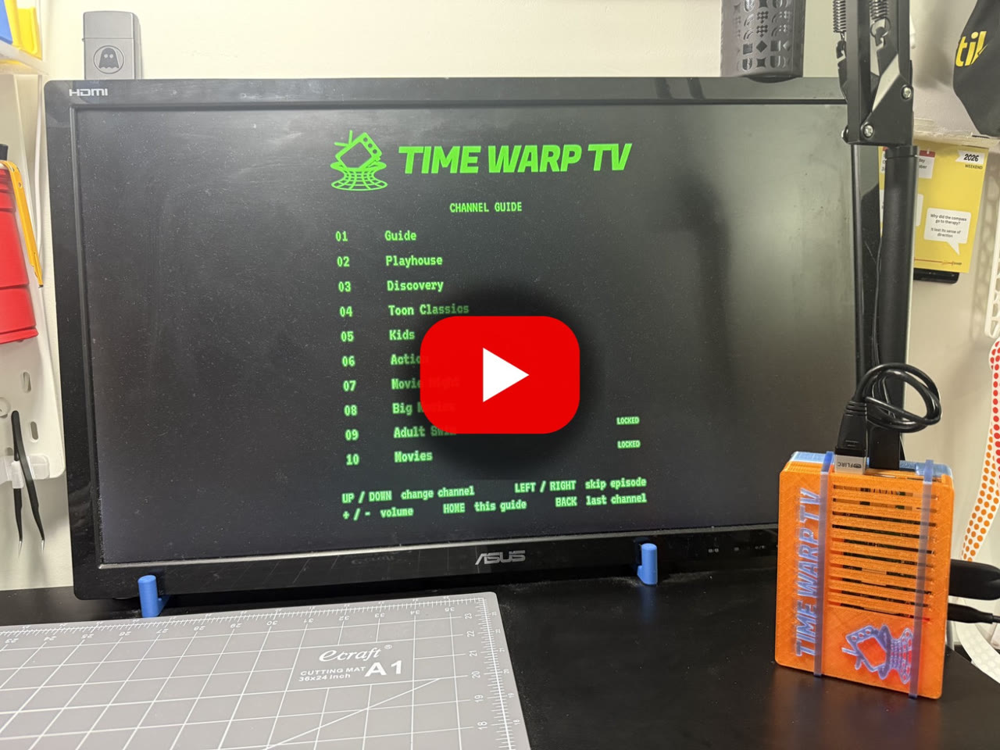
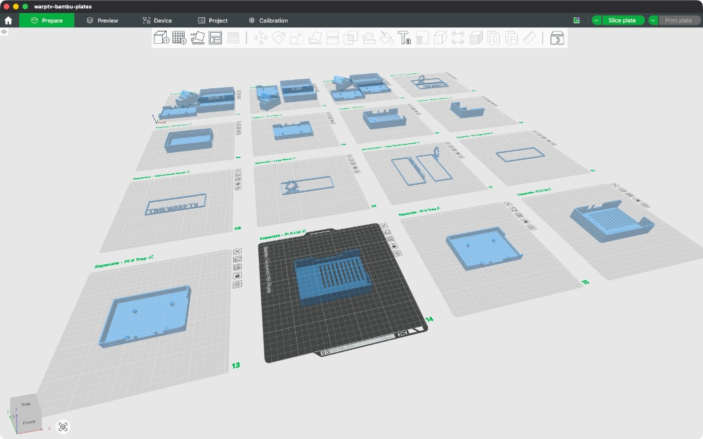

# TimewarpTV

I built Time Warp TV: an offline, retro media player where everything plays on always-on channels. No menus, no doomscrolling, just channel surfing like it's 1997. Channel 1 is the guide, Channel 2 is baby stuff (Wee Sing, Bear in the Big Blue House), Channel 5 is kid prime time (SpongeBob, Ninjago), and the channels grow up as you climb. [Full demo in the video below (goes to YouTube)](https://youtu.be/BpCKqrgoNqk)

[](https://youtu.be/BpCKqrgoNqk)

*Built on [NostalgiaBox](https://github.com/landonbtw/NostalgiaBox). See [Credits](#credits).*

TimewarpTV plays a library of shows and films off a USB drive like they're real
TV **channels**. Flip to a channel and something is already playing, a few
seconds in, like you just tuned in. Episode ends? The next one rolls on an
endless shuffle. Movie channels pick up where you left off. It boots straight to
the TV on power-up, runs off a simple remote, and looks like it fell out of the
early 2000s: a green on-screen channel banner and volume bar, the Time Warp TV
logo, captions for what's playing, and a curved "CRT" picture.

No menus. No apps. No Wi-Fi needed. Just a remote and channels.

## What it looks like

<table>
  <tr>
    <td width="50%"></td>
    <td width="50%"></td>
  </tr>
  <tr>
    <td><b>Flip to a channel</b>: the channel banner, what's playing (show and episode, or film and year), and the curved "CRT" picture.</td>
    <td><b>Channel 1, the guide</b>: every channel and how to work the remote, on a card the box draws itself.</td>
  </tr>
  <tr>
    <td></td>
    <td></td>
  </tr>
  <tr>
    <td><b>Volume</b>: the classic bar-and-dots readout.</td>
    <td><b>Locked channels</b>: a combination lock you dial with ◀ ▶ and OK, no number pad needed.</td>
  </tr>
  <tr>
    <td></td>
    <td><b>Standby</b>: the logo drifts and bounces around the screen and the wordmark changes corner every minute, so nothing burns into the TV (burn-in is forever). The box goes here by itself after 10 minutes on a still screen.</td>
  </tr>
</table>

<sub>These are real frames from the player, overlays and all. Regenerate them with
`scripts/make-screenshots.py`. Footage: <i>Big Buck Bunny</i> © Blender Foundation,
<a href="https://creativecommons.org/licenses/by/3.0/">CC BY 3.0</a>,
<a href="https://peach.blender.org/">peach.blender.org</a>.</sub>

## Contents

0. [Try it on your computer first](#0-try-it-on-your-computer-first), no Pi needed
1. [What you'll need](#1-what-youll-need)
2. [Setting it up](#2-setting-it-up): the media drive, the SD card, the remote, the install
3. [Using it](#3-using-it): the remote, adding shows, updating
4. [Configuration](#4-configuration)
5. [Troubleshooting](#5-troubleshooting)
6. [How it works](#6-how-it-works)
7. [Printing the case](#7-printing-the-case): the 3MF plates and the raw STLs

---

## 0. Try it on your computer first

Before you buy a single part: you can run the real thing (real mpv playback, in
a window) on a Mac or Linux machine against a fake library that builds itself
in about a minute. Quickest way to see channel changes, the lock, resume and
break blocks without touching a Pi.

```bash
git clone https://github.com/RobErskine/TimewarpTV.git && cd TimewarpTV
brew install mpv ffmpeg          # macOS (sudo apt install mpv ffmpeg on Linux)
python3 -m venv .venv && source .venv/bin/activate
pip install -e ".[dev,desktop]"
./scripts/make-dev-library.sh    # builds dev-media/ + config.dev.yaml (~1 min)
timewarptv --config config.dev.yaml --windowed
```

Drive it with your keyboard. Keys work in **either** window, the video or the
terminal you started it from:

| Key | Does |
|-----|------|
| ↑ / ↓ | Channel up / down |
| ← / → | Volume down / up |
| , / . | Previous / next episode on this channel |
| 0-9, then Enter | Jump to a channel, or enter a code on a locked channel (`1997` on channel 9) |
| m | Mute |
| i | What's playing now |
| l | Last channel watched |
| h | Home (channel 1) |
| p | Standby |
| q / Ctrl-C | Quit |

Every fake clip is 20 seconds of its own channel and show burned into the
picture (riveting television), so a shuffle, a break block (every 2 episodes
here) and a resume (tune away from a movie channel and back) all show up within
a minute. Add `--with-bunny` to also download one real feature-length film;
`--force` regenerates everything.

---

## 1. What you'll need

| Part | Notes |
|------|-------|
| **Raspberry Pi 3 Model B** | What TimewarpTV is built and tested on. A Pi 4 or 5 works too (they use a micro-HDMI cable). |
| **Power supply** | The official Pi 3 supply (5.1 V, 2.5 A, micro-USB). A weaker phone charger causes under-voltage resets. |
| **micro-SD card, 32 GB** | Holds the operating system only; the videos live on the drive. |
| **USB drive for the library** | Formatted **exFAT**. For scale: 2,800 episodes and films of mostly standard-definition TV take about 430 GB. [This project uses a UnionSite 1TB drive](https://amzn.to/4yrPju9). |
| **Powered USB hub** *(recommended)* | A Pi 3 struggles to power a USB hard drive by itself; a hub supplies it instead. |
| **[Flirc USB receiver](https://amzn.to/3VoDbLW)** | Lets an IR remote control the Pi by turning button presses into keystrokes. |
| **[Argon IR Remote](https://amzn.to/4AKZBXO)** | The remote the button layout below is written for. Any IR remote works with the Flirc. |
| **HDMI cable** | Full-size HDMI for a Pi 3. |
| **A TV with HDMI** | Its own remote can control the box too, over HDMI-CEC, if the TV supports it. |
| **A computer** (Mac or PC) | To build the media drive, flash the SD card and program the Flirc. |

---

## 2. Setting it up

Parts A-C are on your **computer**; D-H are on the Pi, over the network.

### Part A: Build the media drive

Everything the box knows lives on one USB drive: a folder per channel, plus a
`config.yaml` that names them. That's the whole database.

1. **Format the drive exFAT** (readable and writable by Mac, PC and Pi) and name
   it **`WARPMEDIA`**, since that's the name the box looks for. On a Mac: Disk Utility →
   Erase → Format *ExFAT*, Name *WARPMEDIA*.
2. **Fill the channel folders.** One folder per channel at the top of the drive,
   numbered so they sort in channel order. Shows go inside, season folders and
   all:

   ```
   WARPMEDIA/
   ├── config.yaml
   ├── 01-guide/                  (the welcome card - made in Part G)
   ├── 02-playhouse/
   │   ├── Some Puppet Show (1997)/Season 1/…
   │   └── A Sing-Along Video (1990)/…
   ├── 05-kids/
   ├── 07-kid-movies/
   │   └── A Family Film (2003)/A Family Film (2003).mp4
   ├── 09-late-night/
   └── breaks/                    (optional: commercials, bathroom-break cards)
   ```

   Drag shows in by hand, or, if your library is a Plex-style folder of
   `TV Shows/` and `Movies/`, let **`scripts/build-library.sh`** do it. List
   which channel each show belongs on in a manifest (start from
   [`scripts/library.example.tsv`](scripts/library.example.tsv), saved as
   `scripts/library.tsv`), then:

   ```bash
   ./scripts/build-library.sh --dry-run "/path/to/Plex Media" /Volumes/WARPMEDIA   # preview
   ./scripts/build-library.sh           "/path/to/Plex Media" /Volumes/WARPMEDIA   # copy
   ```

   It copies only video files, checks every one with `ffprobe` and removes any
   that are incomplete (a half-finished download would die mid-episode), and
   writes `library-summary.txt` with sizes and running times per channel.
   Re-running it only copies what's new. It insists every show in the source is
   either listed or marked `SKIP`, so nothing gets left off by accident.

   Plex-style names (`Title (1999).mp4`, `Show S01E05 Title.mkv`) also give
   the best on-screen captions.

3. **Write `config.yaml`** in the root of the drive. Start from
   [`config.example.yaml`](config.example.yaml): it lists the channels by
   number, name and folder, and explains every other setting. Folder paths are
   relative to the config, so a channel is just `path: 05-kids`.

### Part B: Flash the SD card

1. Install **[Raspberry Pi Imager](https://www.raspberrypi.com/software/)**.
2. **Unplug the media drive first.** Imager's Storage step lists every external
   disk, and erasing the library you just finished copying is a two-click
   mistake.
3. Insert the micro-SD card. (If it's in a full-size adapter, slide the lock
   switch up.)
4. In Imager:
   - **Device:** Raspberry Pi 3.
   - **OS:** scroll past the first entries (they include a desktop) to
     **Raspberry Pi OS (other) → Raspberry Pi OS Lite (64-bit)**.
   - **Storage:** the SD card, and check the size (a "32 GB" card shows as 31.9 GB).
   - **Customisation:**
     - **Hostname:** `warptv`
     - **Localisation:** your time zone and keyboard layout
     - **User:** a username and password (write them down)
     - **Wi-Fi:** network, password and **country**. A Pi 3 Model B only does
       **2.4 GHz**, so pick a 2.4 GHz network, or use Ethernet. (The box itself
       never needs a network; this is just for installing.)
     - **Remote access:** turn on **SSH**, with password authentication
5. Write it, let it verify, and eject.

### Part C: Program the remote (Flirc)

The Flirc is the magic trick here: it learns each button on your remote and
replays it as a keystroke, so the Pi just thinks somebody's typing. Do this on
your **computer**:

1. Plug the Flirc into your computer.

   > **On a Mac, a "Keyboard Setup Assistant" window may pop up** asking you to
   > press the key next to Shift, then say the keyboard can't be identified.
   > That's macOS, not the Flirc (which shows up as a keyboard with no Z key).
   > Close it; nothing is wrong.

2. Install the **Flirc app** from the Downloads section of the
   [Flirc USB page](https://flirc.tv/products/flirc-usb-receiver). The bottom of
   its window should say **Connected**; accept any firmware update.
3. **File → Clear Configuration**, then **Controllers → Full Keyboard**.
4. For each button: click the key on screen, then press the button on the
   remote. Wait for "Recorded successfully".

   | Argon button | On-screen key | Does |
   |--------------|---------------|------|
   | **▲ / ▼** | Up arrow / Down arrow | Channel up / down |
   | **◀ / ▶** | `,` / `.` | Previous / next episode on this channel |
   | **OK** | Enter | Next digit on a lock screen; "start over" on a resumed film. **Needed to unlock channels.** |
   | **Vol + / Vol −** | `=` / `-` | Volume up / down |
   | **Home** | Home | Back to channel 1, the guide |
   | **Back** | Backspace | Last channel watched |
   | **☰ Menu** | `i` | Show what's playing |
   | **Power** | `p` | Standby |

   Why `,` and `.` for ◀ ▶ instead of the arrow keys? Left/right arrows are
   volume for everything else, including a TV's own remote over HDMI-CEC, so
   the Flirc gets its own keys for skipping.

5. **Test it in a blank text document.** ◀ ▶ Vol+ Vol− ☰ Power should type
   exactly `,.=-ip`; ▲ ▼ move the cursor; OK starts a new line; Back deletes a
   character. If a button types the wrong thing, click **Erase**, press that
   button, and record it again.
6. Optional: **File → Save Configuration** keeps a backup of the mapping.

The mapping lives on the Flirc itself, which is great: unplug it and replug it
into the Pi whenever you want, even while the TV is on, and it's picked up
within a couple of seconds.

### Part D: Plug it in and connect

1. Plug the **Flirc** and the **media drive** (through the powered hub, if you
   have one) into the Pi.
2. Connect the Pi to the TV with **HDMI**, and put in the SD card.
3. Plug in **power** last, and give it about two minutes for the first boot.
4. On your computer, open **Terminal** (Mac) or **PowerShell** (Windows):

   ```bash
   ssh YOUR-USERNAME@warptv.local
   ```

   Type `yes` the first time, then your password (it won't show as you type).
   If `warptv.local` isn't found, use the Pi's IP address from your router
   instead.

### Part E: Install TimewarpTV

```bash
sudo apt update && sudo apt install -y git
git clone https://github.com/RobErskine/TimewarpTV.git ~/TimewarpTV
cd ~/TimewarpTV
./scripts/install.sh
```

This installs the player (mpv), the video tools (ffmpeg), HDMI-CEC support and
everything else, generates the static and colour-bar clips, and adds the
`timewarptv` command. It takes **10-20 minutes on a Pi 3** (go make a coffee)
and finishes with **"==> Done!"**.

### Part F: Make it an appliance

```bash
./scripts/install-service.sh
```

This is the part that turns a Raspberry Pi into an appliance:

- It mounts the drive by its **label** (`WARPMEDIA`) at boot, and whenever
  it's plugged in later.
- It starts TimewarpTV on power-up, straight to the screen: no login, no menus,
  no network.
- It reads `config.yaml` **from the drive**, so channels can be changed on any
  computer.

It finishes by saying whether it found the drive and its `config.yaml`, then
starts the TV. Check what it sees:

```bash
timewarptv --check
```

This lists every channel and how many episodes it found in each.

From now on the box copes with whatever state it gets plugged in in:

| Situation | What happens |
|---|---|
| Normal power-up | Mounts the drive, scans the library, starts on the guide |
| Powered up **without** the drive | Shows *CONNECT THE MEDIA DRIVE*, then starts by itself when you plug it in |
| Drive pulled out while it's on | Goes back to *CONNECT THE MEDIA DRIVE* |
| Drive plugged back in | Mounts it, **re-scans everything**, and carries on |
| `config.yaml` edited | Restarts itself within a few seconds with the new channels |
| New room, house or TV | Nothing to do; it never needs a network |

(Different label or mount point? `./scripts/install-service.sh /mount/path LABEL`.)

### Part G: Finishing touches

**The guide card.** Channel 1 is a still card listing every channel, drawn from
your config:

```bash
timewarptv --make-guide
```

It takes about two minutes on a Pi 3 and writes `01-guide/welcome.mp4` on the
drive. Re-run it whenever you add or rename a channel, since it's a picture and
won't update by itself. Set the station name with `ui.brand` (it shows the logo
and wordmark by default).

**Sound through the TV.** The Pi can default to its headphone jack. List the
outputs:

```bash
timewarptv --list-audio
```

and put the HDMI one in `config.yaml` on the drive (`nano /media/timewarptv/config.yaml`):

```yaml
audio_device: "alsa/default:CARD=vc4hdmi"   # HDMI on a Pi 3
```

Saving the file restarts the TV with the change.

**Make the TV come on to the box.** Most smart TVs insist on opening their own
home screen when you switch them on. Set yours to start on the Pi's HDMI port
instead and the illusion holds. On a Vizio:
**Menu → System → Input at Power On →** *the Pi's HDMI port*. You can still
change input by hand any time.

### Part H: Make it kid-proof

Kids will pull the plug. Not *might*. Will. Two things keep that from
corrupting the SD card:

- **Turn it off with the remote.** Turn the volume down to 0, let go, then press
  Vol − **once more**: the TV says GOODBYE and the Pi shuts down cleanly. It's
  safe to unplug once the green light stops blinking. (Holding Vol − stops at 0
  on purpose, so it can't happen by accident.) Plug it back in to turn it on.
- **Read-only mode (do this last, once everything works).** `sudo raspi-config`
  → **Performance Options → Overlay File System → Enable** (and write-protect the
  boot partition), then reboot. The SD card becomes read-only, so pulling the
  plug can never corrupt it. Nothing is lost: the channel list and resume
  positions live on the drive, which stays writable. To update later, turn the
  overlay off the same way, reboot, update, and turn it back on.

**Done!** Plug it in, hand over the remote, and let somebody find out that
channel 5 exists.

---

## 3. Using it

### The remote

| Do this | Press |
|---------|-------|
| Change channel | ▲ / ▼ |
| Something else on this channel | ▶ (next) / ◀ (back to the one before) |
| Volume | Vol + / Vol − |
| See what's playing | ☰ (the show and episode, or film and year, appear bottom-right) |
| Back to the guide | Home |
| Back to the last channel | Back |
| Unlock a locked channel | ◀ / ▶ to choose each digit, OK for the next |
| Start a resumed film over | OK while "RESUMING - PRESS OK TO START OVER" shows |
| Standby | Power (the logo drifts around, so nothing burns into the TV) |
| **Turn off** (safe to unplug) | At volume 0, let go, then Vol − once more |

A few behaviours worth knowing:

- **Skipping** works like shuffle on a music player: ▶ draws something new, ◀
  goes back, and ▶ after that steps forward again. Holding a button skips once.
  Skips never trigger a break.
- **Locked channels** stay unlocked only while you're on them. Change channel or
  go to standby and they lock right back up. With the Argon remote, `1997` is
  ▶ OK, ◀ OK, ◀ OK, ◀◀◀ OK. The TV's own remote (over HDMI-CEC) or a keyboard
  can type digits directly.
- **The burn-in guard.** After 10 minutes on a still screen (the guide, a lock
  screen, or a channel with nothing on it) with no button pressed, the box goes
  to standby by itself. Shows and films never trigger it.
- **HD films** play without the CRT curve; it comes back for the next older show.

### Adding shows

No terminal, no SSH, no nothing:

1. Unplug the drive from the Pi (the Pi can stay on; it shows *CONNECT THE MEDIA
   DRIVE*).
2. Plug it into your computer and add episodes to the channel folders: drag
   them in, or re-run `./scripts/build-library.sh`.
3. Eject it properly and plug it back into the Pi. It mounts and re-scans by
   itself.

For a **new channel**, also add it to `config.yaml` on the drive, and remake the
guide card (`timewarptv --make-guide` on the Pi) so channel 1 lists it.

### Updating

```bash
cd ~/TimewarpTV
git pull
./scripts/install.sh               # picks up new dependencies and commands
sudo systemctl restart timewarptv
```

(With the read-only overlay on, turn it off first, update, then turn it back
on.)

---

## 4. Configuration

Everything lives in `config.yaml` on the drive.
[`config.example.yaml`](config.example.yaml) documents every setting, but these
are the ones you'll actually touch. Check your changes with
`timewarptv --check`.

```yaml
start_channel: 1           # the channel it powers on to (the guide)
tune_in: random            # random | resume | broadcast
start_offset: [6, 10]      # start each episode 6-10 s in, like you just tuned in
idle_standby_minutes: 10   # still screen + no button presses -> standby (0 = off)
audio_device: "alsa/default:CARD=vc4hdmi"
state_file: .timewarptv-state.json   # resume positions survive a power cut

ui:
  now_playing: true        # caption the show/episode or film/year
  logo: true               # the logo in the corner
  brand: "TIME WARP TV"    # set another name and it's typed on the guide instead
crt:
  enabled: true
  max_height: 720          # taller videos (HD films) play without the CRT effect
```

### Channels

```yaml
channels:
  - number: 5
    name: "Kids"
    path: 05-kids
    exclude_seasons: ["6-25"]   # leave out seasons 6-25
    exclude: ["*special*"]      # leave out anything matching

  - number: 7
    name: "Movie Night"
    path: 07-kid-movies
    tune_in: resume             # pick up where you left off...
    start_offset: 0             # ...from 0:00, not a few seconds in

  - number: 9
    name: "Late Night"
    path: 09-late-night
    passcode: "1997"            # 1-8 digits; a kid gate, not real security
    locked_message: "LATE NIGHT - LOCKED"
```

### Break blocks

Old commercials, station bumpers, or your own "BATHROOM BREAK" / "SNACK TIME"
cards (just video files in a folder) can play between episodes. They never
interrupt a show; a break only ever comes when an episode ends.

```yaml
breaks:
  path: breaks
  every: 2        # after every 2 episodes
  count: [1, 2]   # 1-2 clips each time
```

Turn breaks off for one channel with `breaks: false` on that channel.

---

## 5. Troubleshooting

When something's off, the logs usually tell you why first:
`journalctl -u timewarptv -f` (follow live) or `journalctl -u timewarptv -b`
(this boot).

- **The TV opens its own home screen, not the box.** Set the TV's power-on input
  to the Pi's HDMI port (Part G).
- **No picture.** Check the TV is on the right HDMI input, and that the service
  is running: `systemctl status timewarptv`.
- **No sound.** Set `audio_device` to the HDMI output (Part G).
- **A channel shows 0 episodes in `timewarptv --check`.** Its `path` doesn't
  match the folder on the drive, or the files use an unusual extension (see
  `video_extensions` in the example config).
- **CONNECT THE MEDIA DRIVE won't go away.** The drive must be named `WARPMEDIA`
  and formatted exFAT. `lsblk -f` on the Pi shows what it sees.
- **The remote does nothing.** Test the Flirc in a text document on your
  computer (Part C, step 5). A remote that worked before and quit is almost
  always the Flirc not being pushed all the way in.
- **Can't get past the first digit on a lock screen.** The OK button isn't
  mapped. Teach it **Enter** in the Flirc app (Part C).
- **The Pi resets, or the drive disconnects.** Usually not enough power: use the
  official supply and a powered USB hub. `vcgencmd get_throttled` on the Pi
  reports anything other than `throttled=0x0` if it has happened.
- **A 1080p film stutters.** Add `hwdec: "no"` to `config.yaml`.
- **It won't boot after a power cut.** The SD card was corrupted by an unclean
  shutdown. Re-flash it (Parts B, E and F; the drive is untouched), then turn
  on read-only mode (Part H).

---

## 6. How it works

Plain Python, no magic. The logic (channel scanning, the shuffle, the TV state
machine) has zero hardware dependencies and is covered by tests; the video
player and the remote input sit behind small interfaces. Which means you can
drive the whole thing on a laptop with a mock player and no video at all:

```bash
pip install -e ".[dev]"
pytest
timewarptv --dry-run --config config.dev.yaml   # keyboard-controlled, no video
```

```
timewarptv/             the Python package
├── app.py         the TV state machine
├── config.py      YAML -> validated config
├── channel.py     folder scanning, tune-in modes, skip history, locks, breaks
├── playlist.py    the shuffle bag (each episode once, then reshuffle)
├── state.py       resume positions (survive a power cut)
├── player.py      mpv player (+ a mock for tests); CRT auto-off for HD
├── overlay.py     the on-screen display: banner, volume, captions, lock, standby
├── brand.py       the logo and wordmark, drawn from their SVGs
├── titles.py      "now playing" captions from file and folder names
├── screensaver.py the bouncing-logo standby screensaver
├── guide_gen.py   renders the channel-1 guide card
├── media_watch.py re-scans when the drive is unplugged or its config changes
├── crt.py         the CRT shader
├── static_gen.py  generated static, glitch and colour-bar clips
└── input/         remote input: Flirc/keyboard, HDMI-CEC, key map
```

The logo and wordmark are `timewarptv/assets/logo.svg` and `wordmark.svg`;
replace them and every screen picks up the new art.

---

## 7. Printing the case

The orange box in the video isn't a store-bought enclosure, it's printed! All of
it lives in [`3d-print/`](3d-print), and there are separate Pi parts for the 3, 4
and 5 because the standoffs and IO differ slightly between each one.



### The easy way: the 3MF

Open [`3d-print/3mf/warptv-bambu-plates.3mf`](3d-print/3mf) in Bambu Studio and
you get one project with **16 labelled plates**, so you're picking plates
instead of hunting for files:

| Plate | What's on it |
|-------|--------------|
| **All One Color - Pi 3** / **Pi 4** / **Pi 5** | The four parts for that Pi, ganged up on one plate. Pick the plate that matches your Pi and ignore the other two. |
| **All One Color - Logo Bands** | The logo band and the wordmark band together. |
| **All One Color - Logo Bands Reversed** | The same bands, oriented to print standing up. |
| **Separate - Drive Tray** | The drive tray on its own. |
| **Seperate - Pi 3 / Pi 4 / Pi 5 Tray** | One Pi tray per plate. |
| **Seperate - Pi 3 / Pi 4 / Pi 5 Lid** | One lid per plate. |
| **Separate - Pi tray hold down** | The little clamp that keeps the Pi put. |
| **Separate - Logo Band** / **Seperate - Wordmark Band** / **Seperate - No Logo band** | The three front-band styles, one per plate. Print whichever one you want on the front. |

The **All One Color** plates are the shortcut: one plate, one filament, done.
The **Separate** plates are there for when you want a part in a different colour
(a white band on an orange box, say) or you need to reprint one piece without
re-slicing everything.

### The other way: raw STLs

If you're not on Bambu Studio, [`3d-print/stl/`](3d-print/stl) has every part as
its own file. Anything sitting at the top level fits all three Pis; the
Pi-specific parts are in `pi3/`, `pi4/` and `pi5/`.

```
3d-print/stl/
├── base.stl              the drive tray
├── pi_holddown.stl       the clamp that holds the Pi in its tray
├── band.stl              front band, plain
├── logo_band.stl         front band with the logo
├── wordmark_band.stl     front band with the TIME WARP TV wordmark
├── pi3/  deck.stl      + lid.stl
├── pi4/  deck_pi4.stl  + lid_pi4.stl
└── pi5/  deck_pi5.stl  + lid_pi5.stl
```

For one box: `base.stl`, `pi_holddown.stl`, the `deck` and `lid` from your Pi's
folder, and **one** of the three bands. The bands are interchangeable, so print
all three if you can't decide (I couldn't).

---

## Credits

TimewarpTV started life as a fork of **[NostalgiaBox](https://github.com/landonbtw/NostalgiaBox)**
by [landonbtw](https://github.com/landonbtw), and the good bones are all theirs:
the channels, the shuffle, the channel banner and volume bar, that CRT look. I
got to stand on a working retro TV and tinker instead of starting from a blank
file.

## License

MIT. See [LICENSE](LICENSE).
